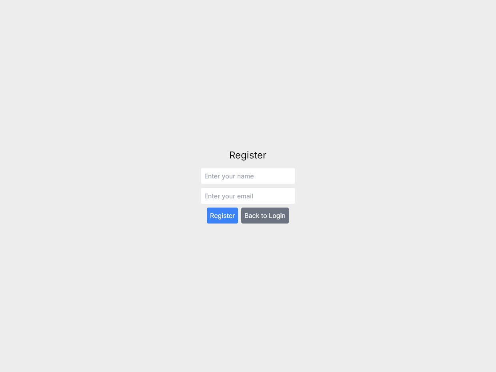
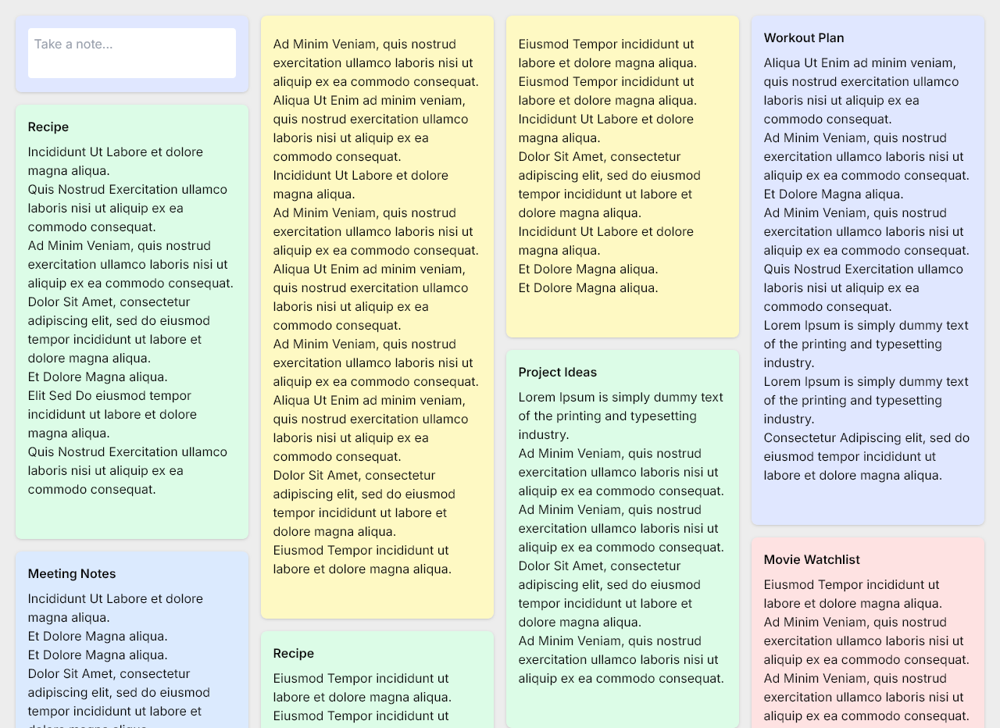

# Yarukoto - The Next Generation of Note-Taking

Yarukoto is a note-taking application that allows users to easily share notes using unique user IDs. This approach simplifies the login process and enables seamless note sharing without the need for passwords.

## Features

- **Unique User IDs**: Users log in using a unique user ID, making it easy to share notes.
- **Note Sharing**: Notes are tied to the user ID, allowing for easy sharing between users.
- **Random Note Generation**: Generate random notes with random titles, content, and colors.
- **Color Picker**: Change the color of notes using a color picker.
- **Note Management**: Add, delete, and archive notes.

## Screenshots

## Usage

### Registration

1. Open the application.
2. Click on the "Register" button.
3. Enter your name and email.
4. Save the generated user ID for future logins.

### Login

1. Open the application.
2. Enter your user ID.
3. Click on the "Login" button.

### Note Management

- **Add Note**: Click on the "Take a note..." area, enter your note content, and click the "+" button to add the note.
- **Delete Note**: Click the trash icon on a note to delete it.
- **Archive Note**: Click the archive icon on a note to archive it.
- **Change Note Color**: Use the color picker on a note to change its color.

## Important Note

This application is designed for easy note sharing and does not use passwords. Therefore, it is not suitable for storing secure or sensitive information.

## Development

### Running Locally

1. Clone the repository.
2. Install dependencies using `npm install`.
3. Start the development server using `npm run dev`.

### File Structure

- **src/components**: Contains React components for the application.
- **src/api**: Contains mock API functions for user and note management.
- **src/types**: Contains TypeScript types for the application.
- **src/data**: Contains mock data for users and notes.

## License

This project is licensed under the MIT License.